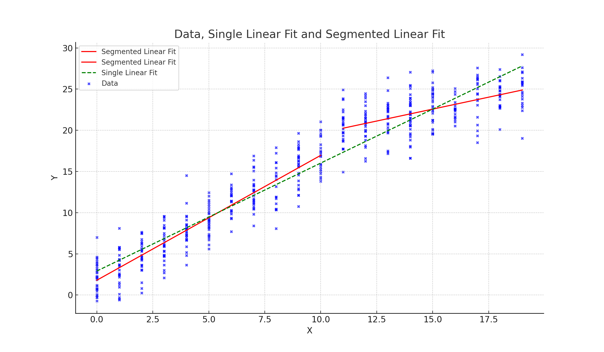

# Segmented Linear Model Selection

This package provides functionalities for fitting and comparing segmented linear models based on given intervals.

## Example

```python
import numpy as np
from matplotlib import pyplot as plt
from segmented_linear.segmented_linear import fit_segmented_linear

# Regenerating the example data
x = np.sort(np.random.choice(20, 500, replace=True))
y_linear = 2 + 1.5 * x + np.random.normal(0, 2, len(x))
y_biphasic = [2 + 1.5 * xi + np.random.normal(0, 2) if xi <= 10 else 15 + 0.5 * xi + np.random.normal(0, 2) for xi in x]
y = np.array(y_biphasic)

# Testing the function without an interval (single linear model)
models_single, x_subsets_single, y_pred_subsets_single, combined_bic_single = fit_segmented_linear(x, y, interval_list=[])

# Testing the function with the provided data and interval_list = [10]
models, x_subsets, y_pred_subsets, combined_bic = fit_segmented_linear(x, y, interval_list=[10])

# Plotting the results for both segmented and single linear models
plt.figure(figsize=(12, 7))

# Plotting the segmented linear fit
for x_subset, y_pred_subset in zip(x_subsets, y_pred_subsets):
    plt.plot(x_subset, y_pred_subset, label='Segmented Linear Fit', color='red')

# Plotting the single linear fit
plt.plot(x_subsets_single[0], y_pred_subsets_single[0], label='Single Linear Fit', color='green', linestyle='--')

plt.scatter(x, y, c='blue', alpha=0.7, s=10, label='Data')
plt.xlabel('X')
plt.ylabel('Y')
plt.title('Data, Single Linear Fit and Segmented Linear Fit')
plt.legend()
plt.grid(True)
plt.show()
```



The most important part is selecting the best model though:
```python
print(combined_bic, combined_bic_single)
#RESULT:
2180.7186640412065, 2340.8857833720713
```

We can see form the above the the segmented fit is more likely for this data, because it has a lower BIC.
